# ISV Simulator: the game

An Overcooked-style couch co-op game about shipping software. 2 to 4 players share one screen, each controlling a developer in a small office. Orders come in, players carry tickets through the stations (code, review, test, pipeline) and ship them before the customer gives up. A round lasts 3 minutes and ends with a score and 1 to 3 stars. Shouting at each other is part of the game.

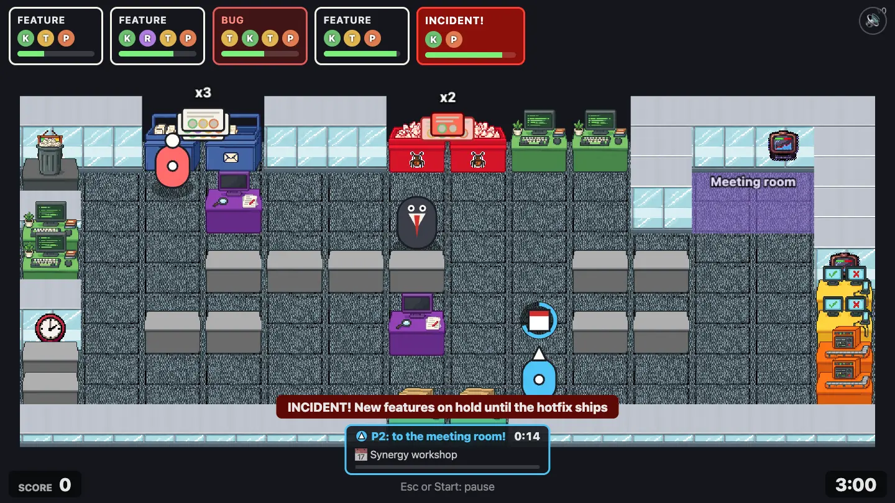

## In these docs

| Page                               | What's in it                                                                                                |
| ---------------------------------- | ----------------------------------------------------------------------------------------------------------- |
| [Stations](stations.md)            | Every tile you can walk up to: inbox, bug queue, keyboard, review, test bench, pipeline, ship, bin, counter |
| [Tickets and events](mechanics.md) | Features, reviews, bugs, hotfixes, the pipeline breaking, throwing, the manager, meetings, scoring          |
| [Levels](levels.md)                | All 12 levels in 4 chapters: layout, map, what's new, star targets                                          |
| This page                          | How a round works, controls, and every screen from title to results                                         |

## How a round works

1. **Orders** appear along the top. Each order card shows its kind and the stations its ticket must visit, in order, as colored letters (K, R, T, P). The bar under it is the time left; the card flashes in the last 10 seconds.
2. A **ticket** for every order waits in a queue: features in the blue **inbox**, bugs and hotfixes in the red **bug queue**. Pick one up.
3. Carry it to each **station** in order and work it there. Keyboards and test benches need someone holding work; the pipeline builds by itself; a review needs two players at once.
4. When every step is done, put it on a **ship** hatch. Points pop up next to the score.
5. When the clock hits 0:00 the round ends. Your score decides the stars.

On top of that each chapter adds a new kind of trouble: production incidents, a manager who walks into people, and calendar invites. See [Tickets and events](mechanics.md).

## Controls

Two players can share a keyboard; up to four can play with gamepads. Directions are screen-relative: up is up on screen.

| Action                    | Left keyboard | Right keyboard     | Gamepad |
| ------------------------- | ------------- | ------------------ | ------- |
| Move                      | WASD          | Arrow keys         | Stick   |
| Pick up / put down / ship | E             | Right Shift        | A       |
| Throw (hold pick-up)      | Hold E        | Hold Right Shift   | Hold A  |
| Work (hold)               | Q             | /                  | X       |
| Dash                      | Left Shift    | Right Alt (Option) | B       |
| Pause                     | Esc           | Esc                | Start   |

Anywhere: **M** or the speaker button in the top right turns all sound off and on.

## Screens

### Title

The title waits for any button. After that it shows the main menu.

|                                            |                                               |
| ------------------------------------------ | --------------------------------------------- |
| 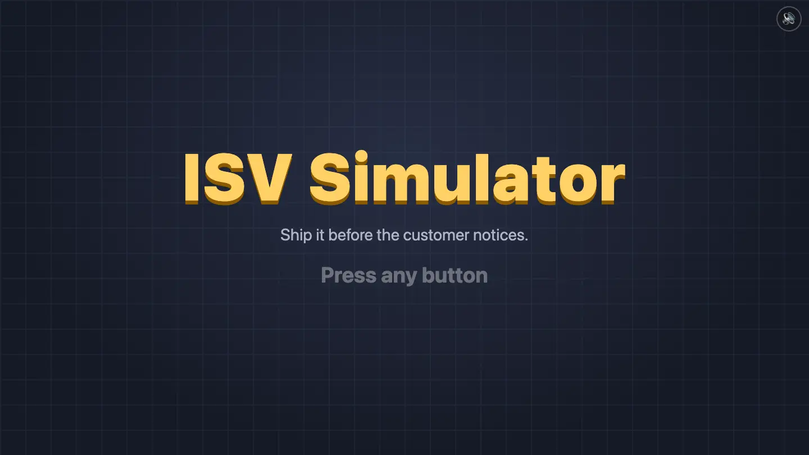 | 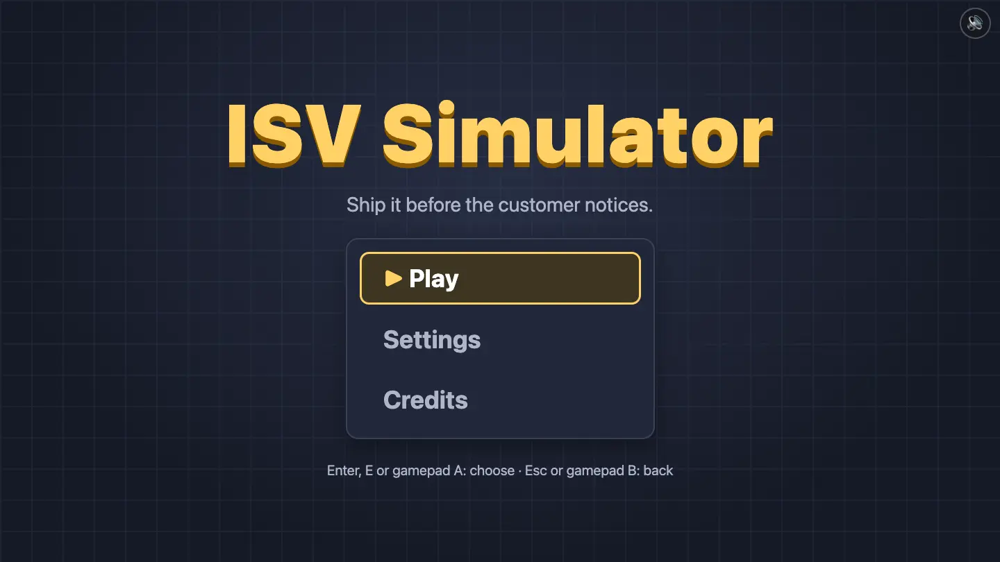 |

Settings has sound volume, music volume and screen shake. Credits lists the asset packs.

|                                           |                                         |
| ----------------------------------------- | --------------------------------------- |
| 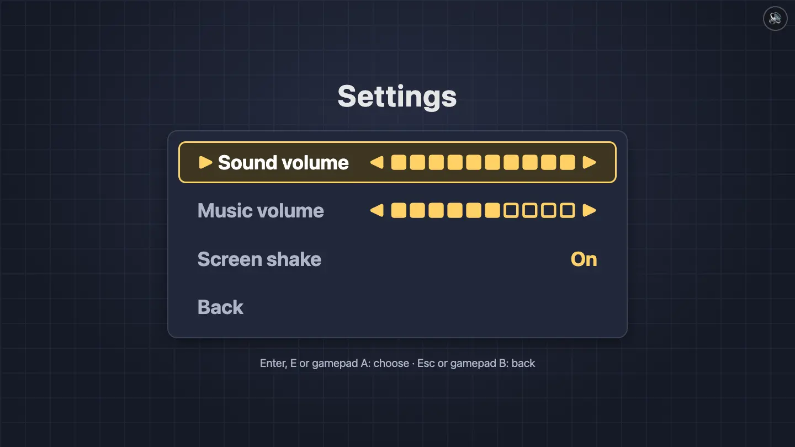 | 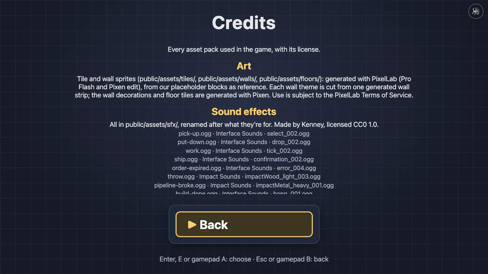 |

### Lobby

Press Enter or gamepad A to join. The first Enter joins the left keyboard, the second the right keyboard; every gamepad joins with A. Each player gets a color and a hat shape (circle, triangle, square, diamond) so players can be told apart without color. Player 1 starts with their pick-up button.

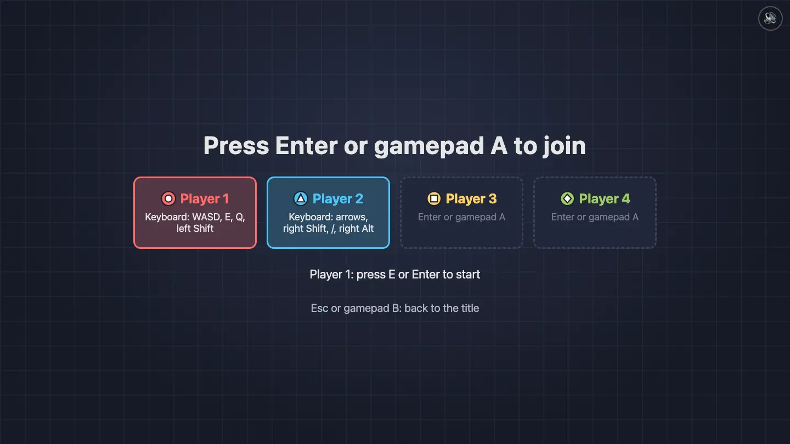

### Level select

Four chapters side by side. Left/right picks a chapter, up/down a level. A level opens once the level before it has at least 1 star; a chapter opens once you have enough stars in total (4, 9 and 13). Each card shows your best stars and score.

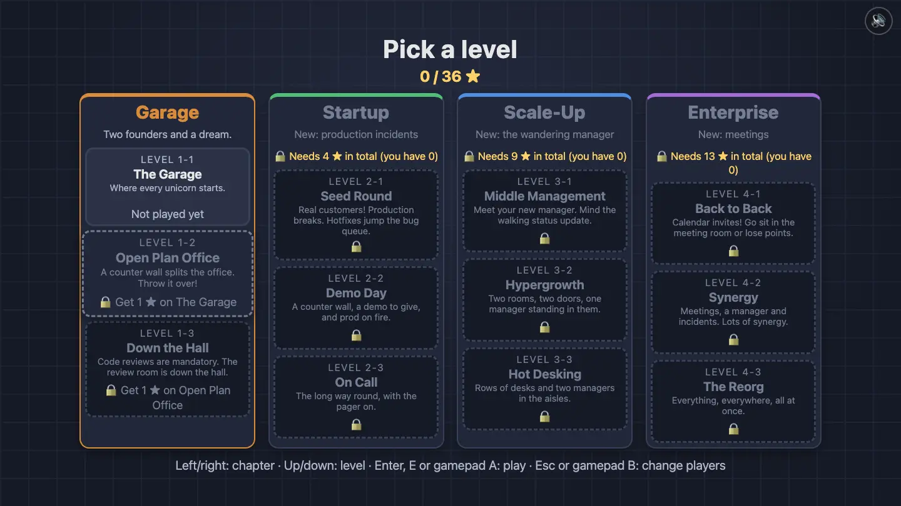

### Level intro card

Before a round, the level's card shows its name, the recipes (which stations each kind of order needs) and, on levels that bring something new, a tip with a picture. The first level also lists every button.

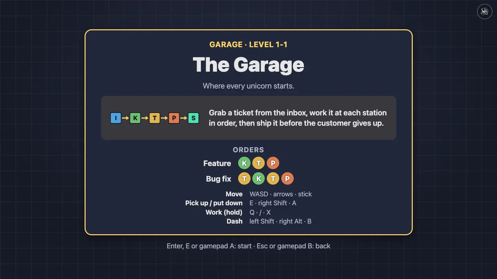

The cards that teach something:

| Level             | Tip                                   |                                                  |
| ----------------- | ------------------------------------- | ------------------------------------------------ |
| Open Plan Office  | Throwing over a counter               | 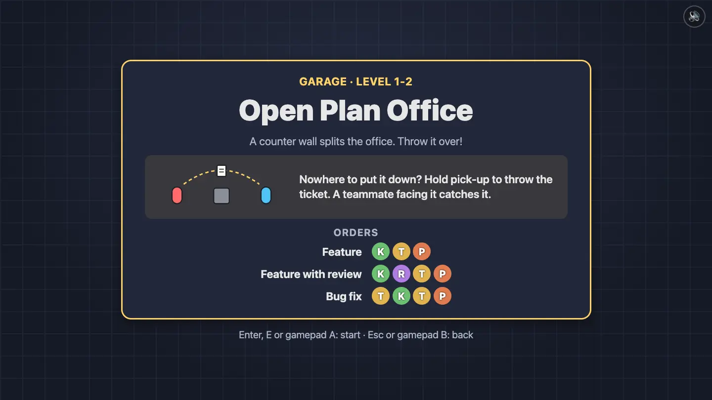         |
| Down the Hall     | Code reviews need two players         | 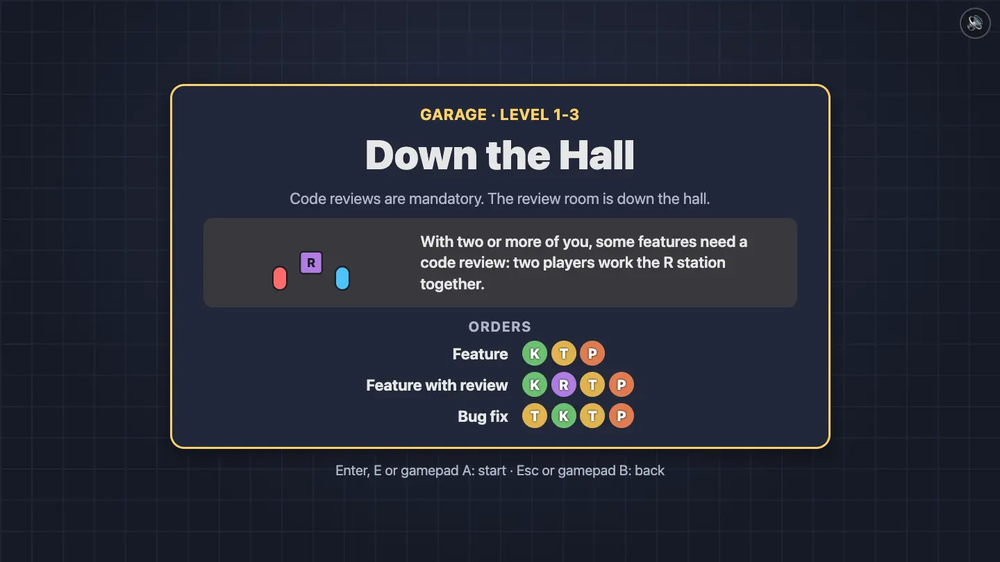          |
| Seed Round        | Production incidents and hotfixes     | 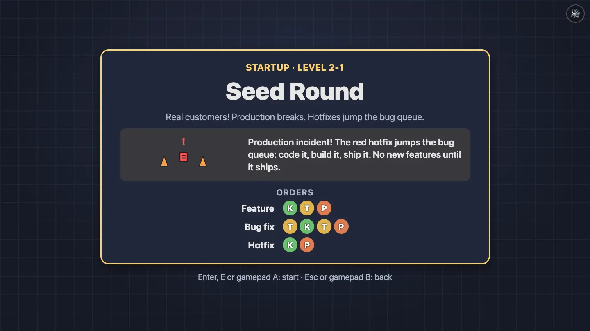        |
| Middle Management | The wandering manager                 | 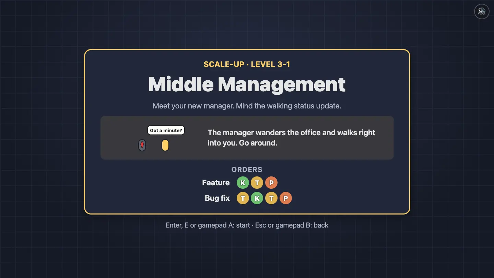 |
| Back to Back      | Calendar invites and the meeting room | 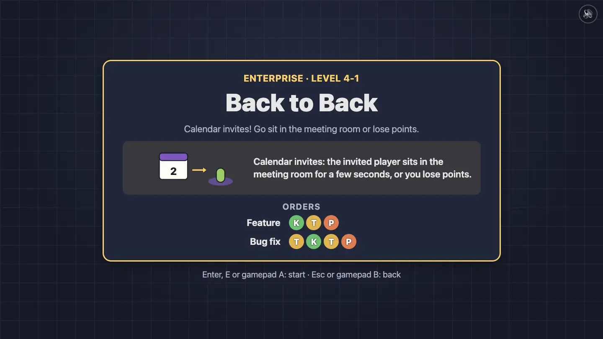      |

### Countdown and first-level hints

"3, 2, 1, Ship it!" and the round starts. The very first time you play The Garage, labels point at the inbox, the keyboard and the ship hatch until each one has been used once.

|                                             |                                                             |
| ------------------------------------------- | ----------------------------------------------------------- |
| 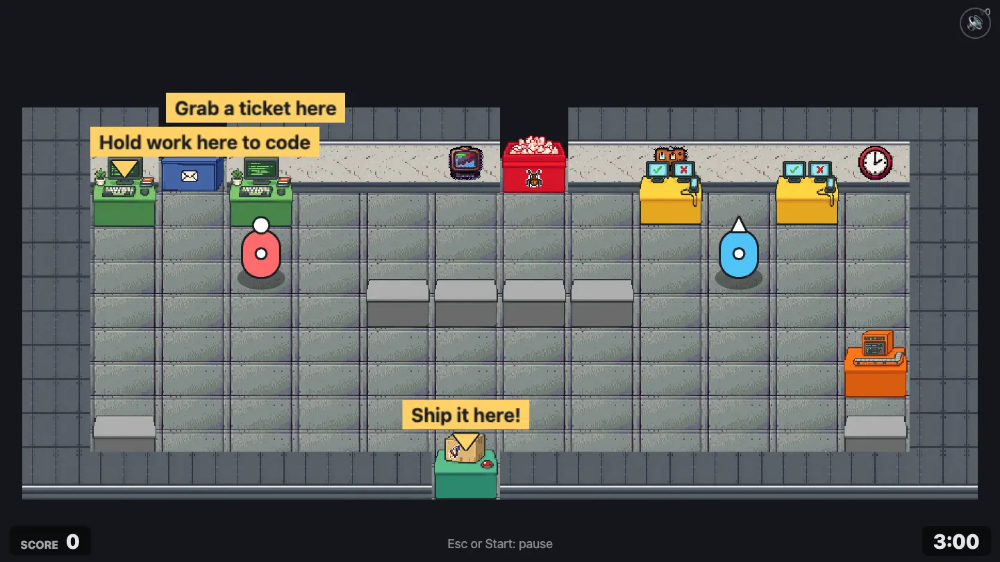 |  |

### Pause

Esc or Start pauses. From here you can resume, restart, change settings, go to the level select, change players (back to the lobby) or quit to the title.

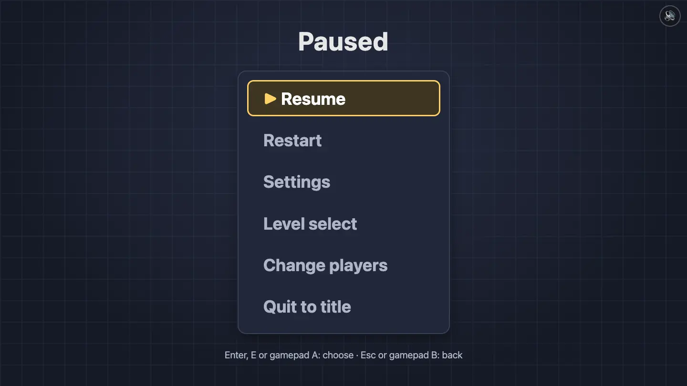

### Results

The stars fill in one by one. The results also say when you beat your best score, unlocked the next level or opened a new chapter.

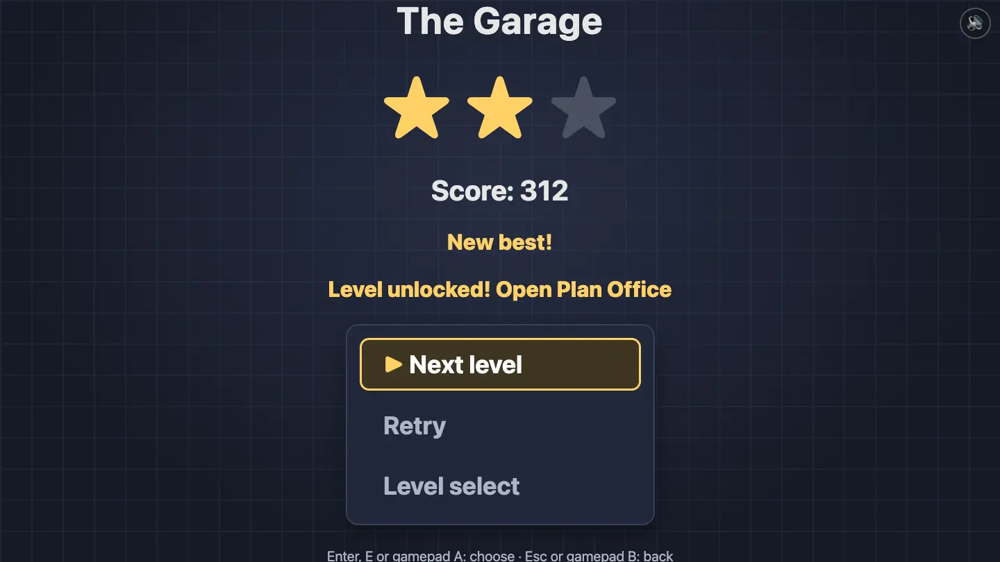

## Updating the screenshots

Every picture in these docs is taken by a script, so they can be retaken after art or UI changes:

```bash
npm run dev
```

```bash
npm run screenshots
```

The script (`scripts/screenshots.ts`) drives headless Chrome. Menus are reached with key presses. Every moment of a round is a **scene** in `src/sim/scenes.ts`: it builds the game state for that moment directly (tickets on stations, a broken pipeline, a manager walking into someone), plays a few ticks with scripted buttons and freezes. Open one by hand with `/?scene=<id>`, e.g. `/?scene=throw`. `scenes.test.ts` checks every scene still reaches its moment, so a game change that breaks a screenshot fails the tests.

Pass `--only=<text>` to retake a subset, e.g. `--only=levels`. To add a picture: add a scene, run the script, link `images/mechanics/<scene id>.webp` (levels go to `images/levels/`).
