# Levels

12 levels in 4 chapters, one new mechanic per chapter. Every level is a 14 × 10 ASCII map in [`maps/`](../../maps) and lasts 3 minutes. Settings (order pace, reviews, incidents, meetings, star targets) live in `src/sim/levels.ts`, names and blurbs in `src/sim/content.ts`.

## Campaign

A level opens when the level before it has at least 1 star. A chapter also needs enough stars in total over all levels.

| Chapter    | What's new                 | Opens at | Levels                                                                                                     |
| ---------- | -------------------------- | -------- | ---------------------------------------------------------------------------------------------------------- |
| Garage     | Two founders and a dream.  | —        | [The Garage](#11-the-garage), [Open Plan Office](#12-open-plan-office), [Down the Hall](#13-down-the-hall) |
| Startup    | New: production incidents  | 4 ★      | [Seed Round](#21-seed-round), [Demo Day](#22-demo-day), [On Call](#23-on-call)                             |
| Scale-Up   | New: the wandering manager | 9 ★      | [Middle Management](#31-middle-management), [Hypergrowth](#32-hypergrowth), [Hot Desking](#33-hot-desking) |
| Enterprise | New: meetings              | 13 ★     | [Back to Back](#41-back-to-back), [Synergy](#42-synergy), [The Reorg](#43-the-reorg)                       |

Unless a level says otherwise, feature orders come every 20 seconds (solo, a few seconds either way), at most 3 are open at once, features last 75 seconds and bugs 45. More players get orders faster and higher star targets: see [Tickets and events](mechanics.md#orders-and-tickets).

### Reading the maps

`#` wall · `.` floor · `C` counter · `I` inbox · `B` bug queue · `K` keyboard · `R` review · `T` test bench · `P` pipeline · `S` ship · `X` bin · `1`–`4` player spawns · `M` manager start · `m` meeting room. See [Stations](stations.md).

The screenshots show four players on their spawns with a few orders open.

## Chapter: Garage

_Two founders and a dream._

### 1-1 The Garage

> Where every unicorn starts.

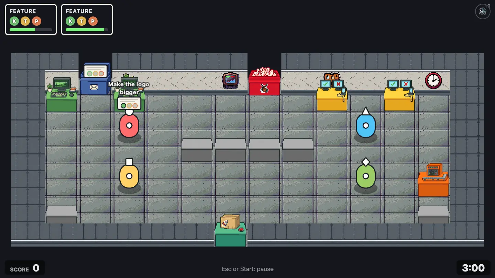

One inbox, one bug queue, two keyboards, two test benches, one pipeline everybody shares and a single ship hatch. Orders come faster here than in the other Garage levels (every 15 s, up to 4 open), so it isn't a walk in the park. The first time you play it, hints point at the inbox, a keyboard and the ship hatch.

- **New here:** The basics: pick up, code, test, build, ship.
- **Extras:** —
- **Map:** [`maps/level-01-garage.txt`](../../maps/level-01-garage.txt)

```text
##I####B######
#K.K.....T.T.#
#............#
#..1......2..#
#....CCCC....#
#............#
#..3......4.P#
#............#
#C..........C#
######S#######
```

| Players      | 1          | 2           | 3           | 4           |
| ------------ | ---------- | ----------- | ----------- | ----------- |
| ★ / ★★ / ★★★ | 80/150/220 | 140/260/370 | 180/350/510 | 220/420/620 |

### 1-2 Open Plan Office

> A counter wall splits the office. Throw it over!

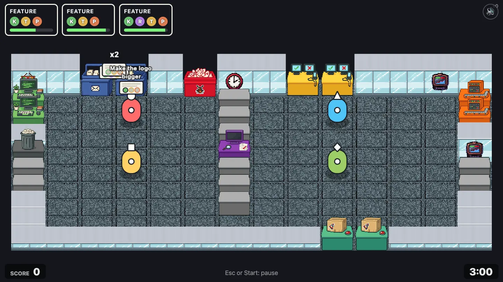

A counter wall runs down the middle with the review station in it. Keyboards are on the left; test benches, pipelines and ship hatches on the right. Walk around the bottom, or throw tickets over the wall.

- **New here:** Throwing. Code reviews (30% of features, two or more players).
- **Extras:** Reviews 30%
- **Map:** [`maps/level-02-open-plan.txt`](../../maps/level-02-open-plan.txt)

```text
##II#B##TT####
K.....C......P
K..1..C..2...P
#.....C......#
X.....R......#
C..3..C..4...C
C.....C......C
#.....C......#
#............#
#########SS###
```

| Players      | 1         | 2          | 3           | 4           |
| ------------ | --------- | ---------- | ----------- | ----------- |
| ★ / ★★ / ★★★ | 50/90/140 | 80/150/230 | 100/210/310 | 130/250/380 |

### 1-3 Down the Hall

> Code reviews are mandatory. The review room is down the hall.

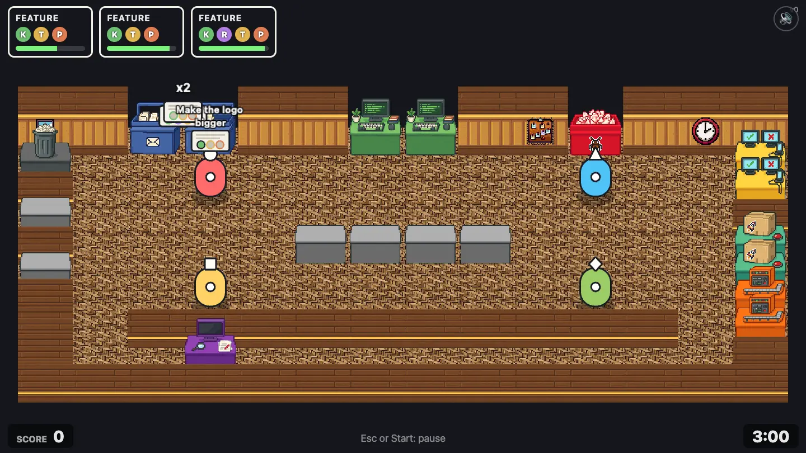

The review station sits at the end of a long corridor along the bottom. Half of the features need a review, so two players keep making the trip together.

- **New here:** Reviews on half the features.
- **Extras:** Reviews 50%
- **Map:** [`maps/level-03-scale-up.txt`](../../maps/level-03-scale-up.txt)

```text
##II##KK##B###
X............T
#..1......2..T
C............#
#....CCCC....S
C............S
#..3......4..P
#.##########.P
#..R.........#
##############
```

| Players      | 1         | 2          | 3           | 4           |
| ------------ | --------- | ---------- | ----------- | ----------- |
| ★ / ★★ / ★★★ | 50/90/140 | 80/150/230 | 100/210/310 | 130/250/380 |

## Chapter: Startup

_New: production incidents_

### 2-1 Seed Round

> Real customers! Production breaks. Hotfixes jump the bug queue.

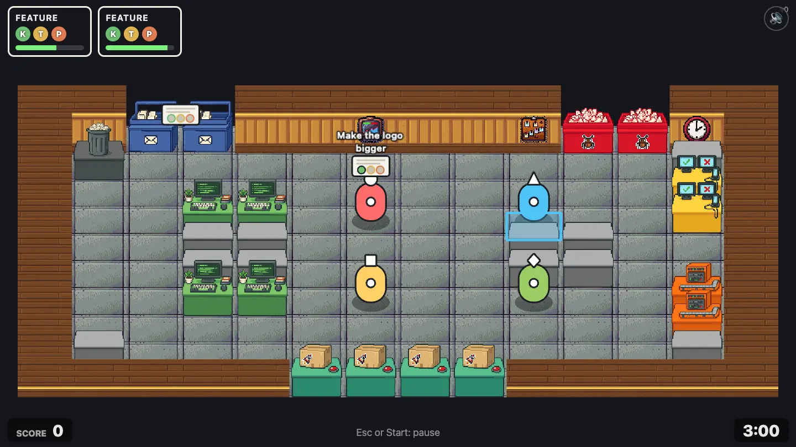

An open loft with a desk island in the middle: four keyboards facing each other, counters between them, two test benches and two pipelines on the right, four ship hatches.

- **New here:** Production incidents, on a calm schedule: the first after 30 s, then about every 60 s, 35 s to fix each.
- **Extras:** Incidents (calm)
- **Map:** [`maps/level-04-seed-round.txt`](../../maps/level-04-seed-round.txt)

```text
##II######BB##
#X..........C#
#...........T#
#..KK.1..2..T#
#..CC....CC..#
#..CC....CC..#
#..KK.3..4..P#
#...........P#
#C..........C#
#####SSSS#####
```

| Players      | 1          | 2           | 3           | 4           |
| ------------ | ---------- | ----------- | ----------- | ----------- |
| ★ / ★★ / ★★★ | 70/130/200 | 110/220/340 | 150/300/460 | 180/360/560 |

### 2-2 Demo Day

> A counter wall, a demo to give, and prod on fire.

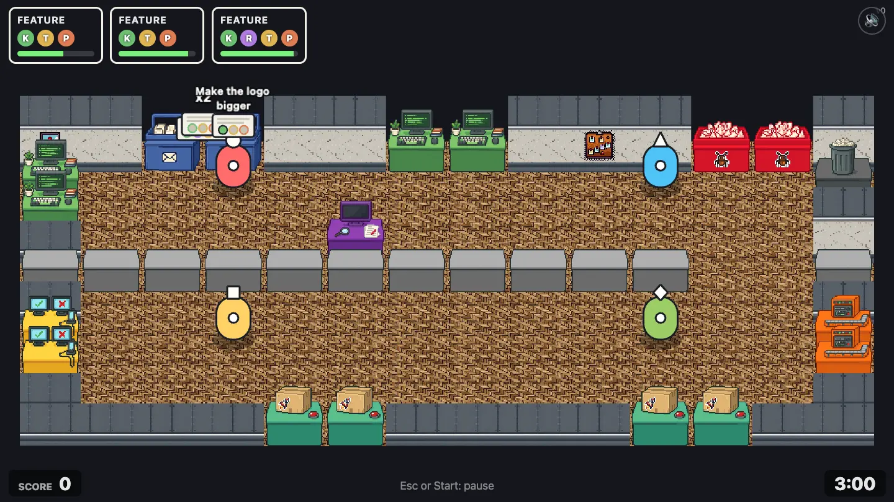

A counter wall across the whole room with one gap on the right. Inbox, keyboards and review up top; test benches, pipelines and ship hatches down below. Throw it over or take the long way.

- **New here:** Incidents at full pace, plus reviews and throwing.
- **Extras:** Reviews 30%, incidents
- **Map:** [`maps/level-05-demo-day.txt`](../../maps/level-05-demo-day.txt)

```text
##II##KK###BB#
K..1......2..X
K............#
#....R.......#
CCCCCCCCCCC..C
#............#
T..3......4..P
T............P
#............#
####SS####SS##
```

| Players      | 1          | 2          | 3           | 4           |
| ------------ | ---------- | ---------- | ----------- | ----------- |
| ★ / ★★ / ★★★ | 50/100/160 | 90/170/260 | 110/230/360 | 140/280/430 |

### 2-3 On Call

> The long way round, with the pager on.

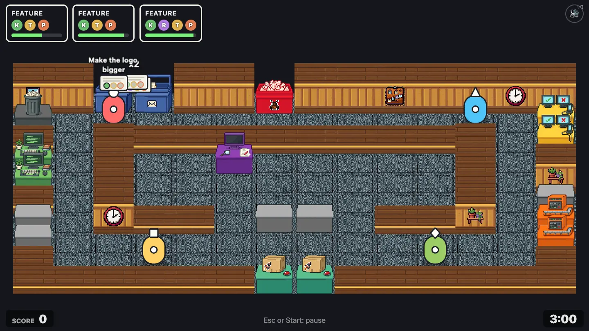

A ring corridor runs around the review room, which opens only at the bottom. Stations sit on the outside walls, so every ticket takes the long way round.

- **New here:** Long walks while production burns.
- **Extras:** Reviews 40%, incidents
- **Map:** [`maps/level-06-on-call.txt`](../../maps/level-06-on-call.txt)

```text
##II##B#######
X.1........2.T
#.##########.T
K.#..R.....#.#
K.#........#.#
#.#........#.C
C.###.CC.###.P
C............P
#..3......4..#
######SS######
```

| Players      | 1         | 2          | 3           | 4           |
| ------------ | --------- | ---------- | ----------- | ----------- |
| ★ / ★★ / ★★★ | 50/90/130 | 80/150/220 | 100/210/300 | 130/250/360 |

## Chapter: Scale-Up

_New: the wandering manager_

### 3-1 Middle Management

> Meet your new manager. Mind the walking status update.

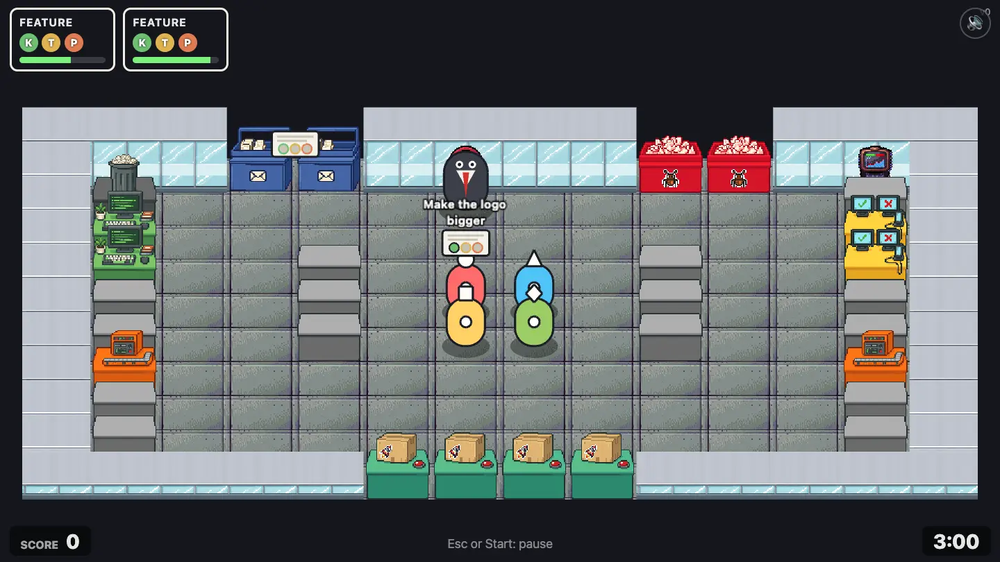

Wide aisles between two short counter rows, two of each station and four ship hatches. Plenty of room, which you'll need.

- **New here:** The wandering manager, and nothing else new.
- **Extras:** 1 manager
- **Map:** [`maps/level-07-middle-management.txt`](../../maps/level-07-middle-management.txt)

```text
###II####BB###
#X....M.....C#
#K..........T#
#K..C....C..T#
#C..C.12.C..C#
#C..C.34.C..C#
#P..........P#
#C..........C#
#C..........C#
#####SSSS#####
```

| Players      | 1          | 2          | 3           | 4           |
| ------------ | ---------- | ---------- | ----------- | ----------- |
| ★ / ★★ / ★★★ | 60/120/170 | 90/200/290 | 130/260/390 | 150/320/480 |

### 3-2 Hypergrowth

> Two rooms, two doors, one manager standing in them.

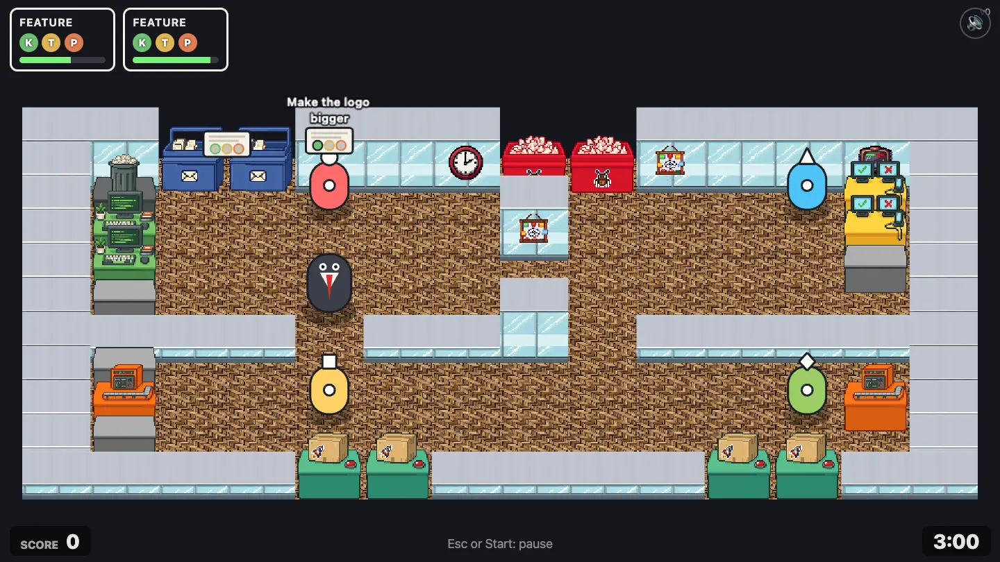

Two rooms joined by two narrow doors. Code at the top, pipelines and ship hatches at the bottom. The manager likes to stand right in the doorway.

- **New here:** Manager plus incidents.
- **Extras:** 1 manager, incidents
- **Map:** [`maps/level-08-hypergrowth.txt`](../../maps/level-08-hypergrowth.txt)

```text
##II###BB#####
#X..1..#...2T#
#K.....#....T#
#K..........C#
#C..M..#.....#
####.###.#####
#C...........#
#P..3......4P#
#C...........#
####SS####SS##
```

| Players      | 1          | 2          | 3           | 4           |
| ------------ | ---------- | ---------- | ----------- | ----------- |
| ★ / ★★ / ★★★ | 50/100/160 | 90/170/260 | 110/230/360 | 140/280/430 |

### 3-3 Hot Desking

> Rows of desks and two managers in the aisles.

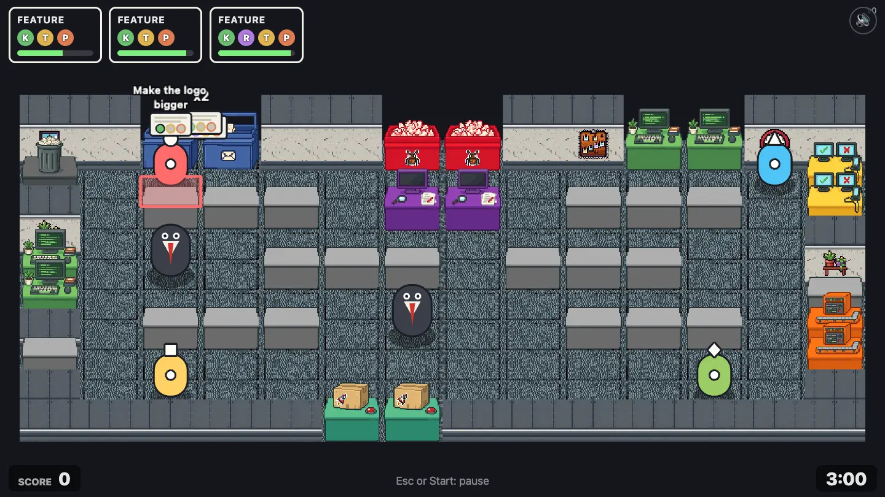

Rows of counter desks with two review stations in the middle and two managers walking the aisles between them.

- **New here:** Two managers, reviews and incidents.
- **Extras:** 2 managers, reviews 30%, incidents
- **Map:** [`maps/level-09-hot-desking.txt`](../../maps/level-09-hot-desking.txt)

```text
##II##BB##KK##
X.1.........2T
#.CCC.RR.CCC.T
#............#
K.M.CCC.CCC..#
K............C
#.CCC.M..CCC.P
C............P
#.3........4.#
#####SS#######
```

| Players      | 1          | 2          | 3           | 4           |
| ------------ | ---------- | ---------- | ----------- | ----------- |
| ★ / ★★ / ★★★ | 50/100/160 | 90/170/260 | 110/230/360 | 140/280/430 |

## Chapter: Enterprise

_New: meetings_

### 4-1 Back to Back

> Calendar invites! Go sit in the meeting room or lose points.

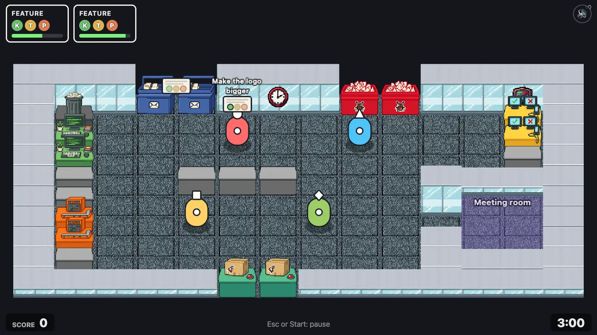

A calm office with a glass meeting room on the right (the `m` tiles).

- **New here:** Meetings, on a calm schedule: the first invite after 20 s, then about every 45 s (solo), 25 s to get there.
- **Extras:** Meetings (calm)
- **Map:** [`maps/level-10-back-to-back.txt`](../../maps/level-10-back-to-back.txt)

```text
###II###BB####
#X..........T#
#K...1..2...T#
#K..........C#
#C..CCC...####
#C........#mm#
#P..3..4...mm#
#P........#mm#
#C........####
#####SS#######
```

| Players      | 1          | 2          | 3           | 4           |
| ------------ | ---------- | ---------- | ----------- | ----------- |
| ★ / ★★ / ★★★ | 50/100/150 | 90/170/250 | 110/230/330 | 140/280/410 |

### 4-2 Synergy

> Meetings, a manager and incidents. Lots of synergy.

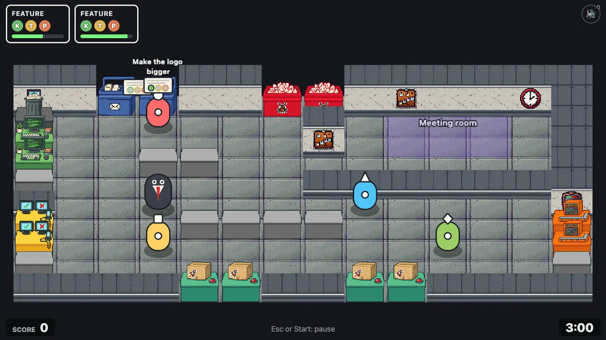

The meeting room is up a corridor in the top right. A manager wanders the main room and production still breaks.

- **New here:** Meetings at full pace with a manager and incidents.
- **Extras:** Meetings, 1 manager, incidents
- **Map:** [`maps/level-11-synergy.txt`](../../maps/level-11-synergy.txt)

```text
##II##BB######
X..1...#.mmm.#
K......#.mmm.#
K..CC........#
C......#######
#..M....2....#
T...CCCC.....P
T..3......4..P
C............C
####SS##SS####
```

| Players      | 1         | 2          | 3           | 4           |
| ------------ | --------- | ---------- | ----------- | ----------- |
| ★ / ★★ / ★★★ | 50/90/140 | 80/150/230 | 100/210/310 | 130/250/380 |

### 4-3 The Reorg

> Everything, everywhere, all at once.

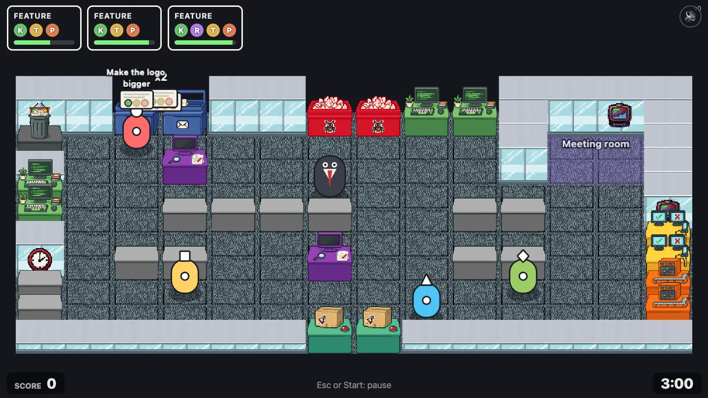

Two review stations, four keyboards, a meeting room in the corner, a manager in the middle, incidents and meetings. Everything the game has.

- **New here:** Everything at once.
- **Extras:** Reviews 30%, incidents, meetings, 1 manager
- **Map:** [`maps/level-12-the-reorg.txt`](../../maps/level-12-the-reorg.txt)

```text
##II##BBKK####
X.1.......#mm#
#..R......#mm#
K.....M......#
K..CCCC..CC..#
#............T
#.CC..R..CC..T
C..3......4..P
C.......2....P
######SS######
```

| Players      | 1         | 2          | 3           | 4           |
| ------------ | --------- | ---------- | ----------- | ----------- |
| ★ / ★★ / ★★★ | 50/90/140 | 80/150/240 | 100/210/320 | 130/250/390 |
