# Tickets and events

Everything that can happen in a round: the kinds of orders, what goes wrong, and how it's scored. For the stations themselves see [Stations](stations.md).

## Orders and tickets

Every order on the bar at the top has a ticket waiting in a queue. The card shows the order's kind, the stations its ticket needs in order, and the time left.

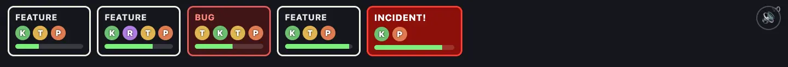

| Kind                    | Card                    | Steps         | Waits in                 | Time       | Shipped                   | Runs out |
| ----------------------- | ----------------------- | ------------- | ------------------------ | ---------- | ------------------------- | -------- |
| **Feature**             | White, "FEATURE"        | K → T → P     | Inbox                    | 75 s       | 20 + up to 10 speed bonus | −10      |
| **Feature with review** | White, purple R         | K → R → T → P | Inbox                    | 75 s       | 20 + up to 10 speed bonus | −10      |
| **Bug**                 | Red, "BUG"              | T → K → T → P | Bug queue                | 45 s       | 0                         | −20      |
| **Incident (hotfix)**   | Bright red, "INCIDENT!" | K → P         | Bug queue, first in line | 30 to 35 s | 20 + up to 10 speed bonus | −30      |

- The **speed bonus** is 10 points when shipped right away, going down to 0 as the timer runs out.
- When an order runs out its penalty is taken and one waiting ticket of that kind leaves its queue.
- More players means features come faster (1.7× for two, 2.3× for three, 2.8× for four), more can be open at once, and the star targets go up by the same factor.
- Ticket titles ("Center a div", "Add AI to it", "Upgrade to YAML 2") are flavour only. Add your own in `src/sim/content.ts`.

## Features

The basic job: grab a ticket from the inbox, code it at a keyboard, test it at a test bench, build it in the pipeline, ship it.

| Code                                       | Test                                        |
| ------------------------------------------ | ------------------------------------------- |
| 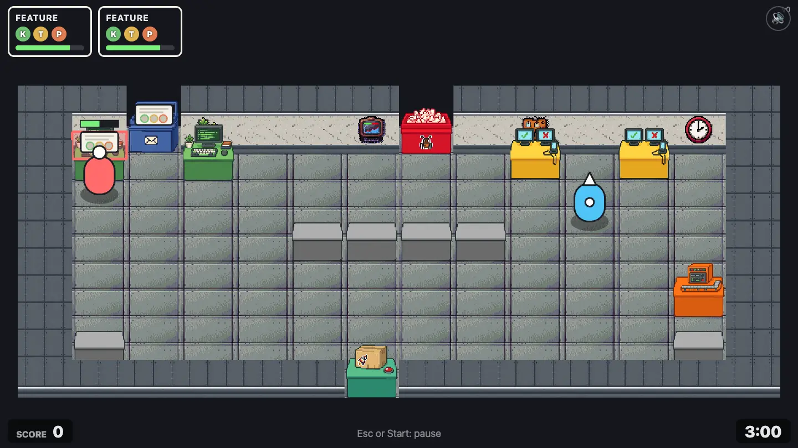 | 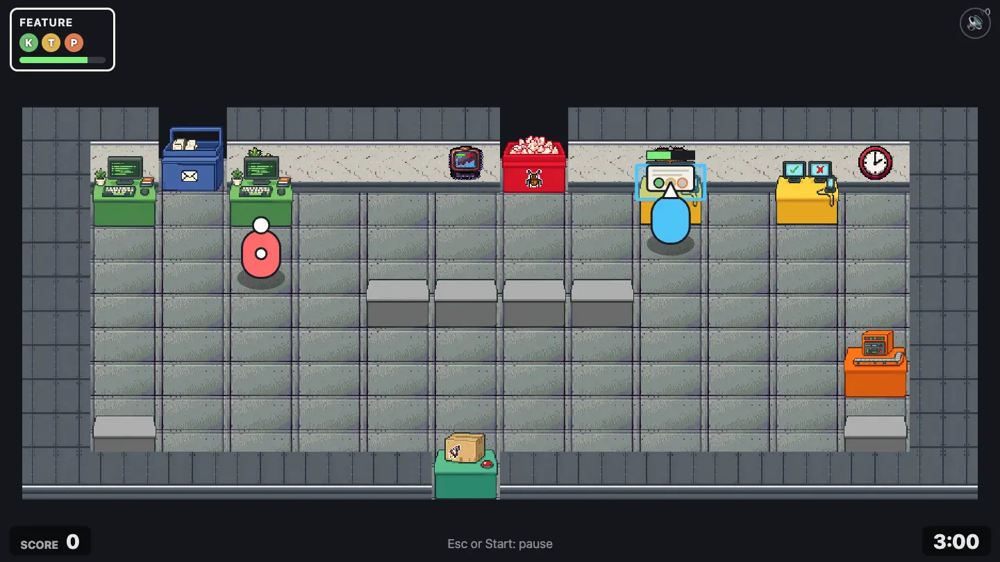 |

| Build                                             | Ship                                    |
| ------------------------------------------------- | --------------------------------------- |
| 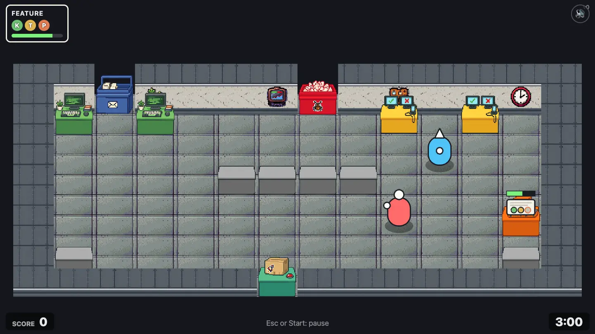 | 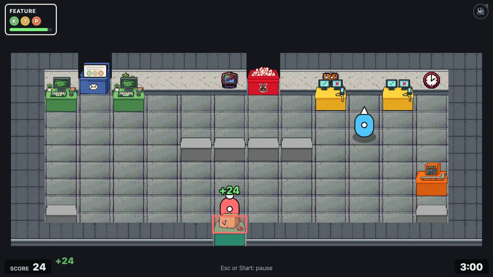 |

## Code reviews

From Open Plan Office on (with two or more players), some features need a code review between coding and testing. Two players have to hold work at the review station together. Solo, no order ever needs a review.

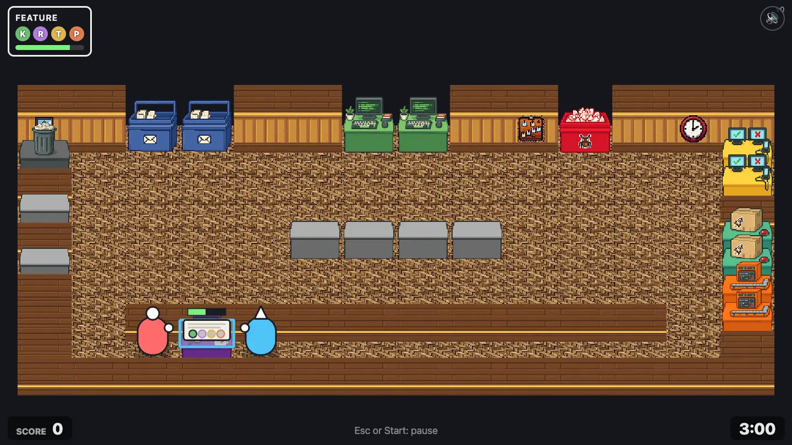

## Skipping tests: YOLO

Testing is the one step you may skip: take a coded ticket straight to the pipeline. It ships for the same points, with "YOLO!" next to them. The catch is bugs.

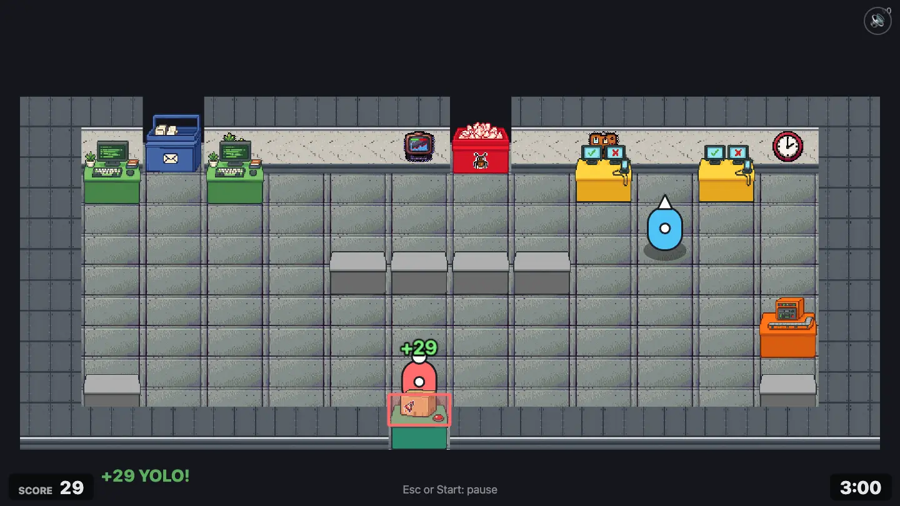

## Bugs

Every shipped ticket may come back as a bug 6 seconds later:

| Shipped       | Chance it comes back as a bug |
| ------------- | ----------------------------- |
| Fully tested  | 25%                           |
| Partly tested | In between                    |
| Untested      | 75%                           |

A bug shows up as a red order and a ticket in the bug queue, titled "Bug: \<the original ticket\>". Fixing it takes test (reproduce), code, test, pipeline. A fixed bug earns **nothing**, and a bug that runs out costs 20, so skipping tests never pays off in the end.

| Bugs waiting                                                                        | Reproducing a bug at the test bench                       |
| ----------------------------------------------------------------------------------- | --------------------------------------------------------- |
| 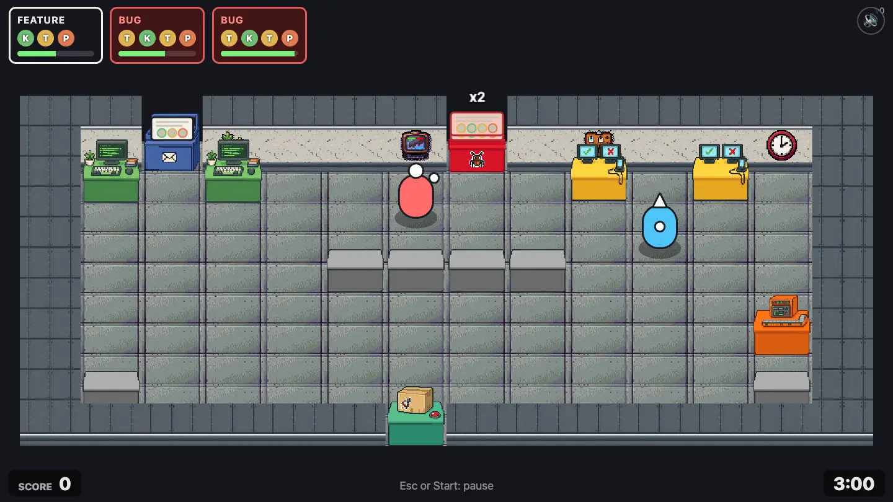 | 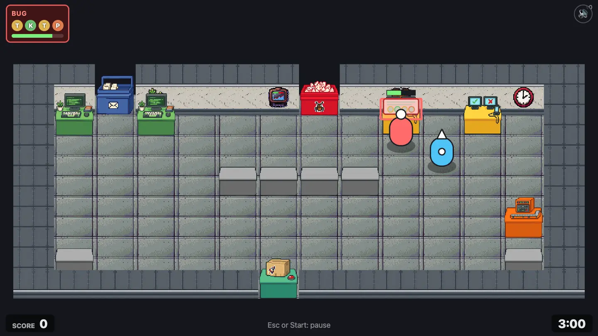 |

## Production incidents (from chapter 2, Startup)

Every 45 seconds or so, production breaks: "Prod is down", "It's DNS", "Certificate expired". An **INCIDENT!** order appears and a red hotfix ticket jumps to the front of the bug queue. While it's open, **no new feature orders arrive**. The hotfix needs only code and pipeline: no time to test. Ship it in time for 20 points plus speed bonus, or lose 30. Only one incident is open at a time.

| Incident open                                                | Coding the hotfix                                  |
| ------------------------------------------------------------ | -------------------------------------------------- |
| 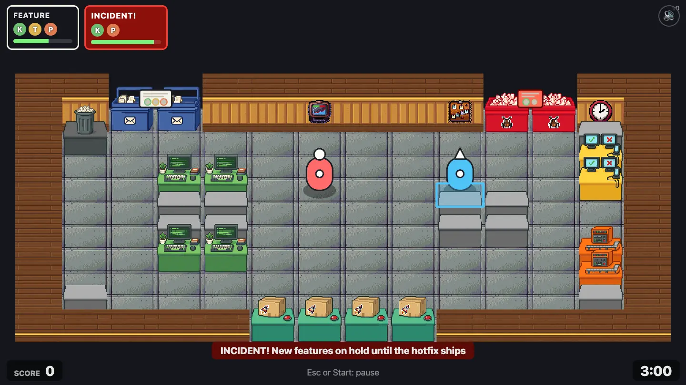 | 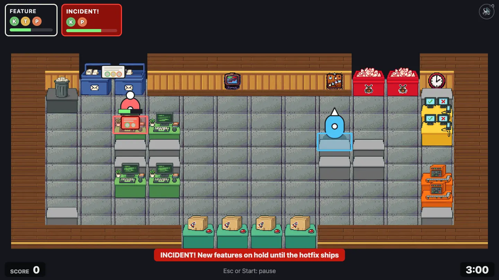 |

## The pipeline breaks

Leave a finished build in the pipeline for more than 10 seconds and the build server goes down: "Build server down!". Take the ticket out and hold work at the empty pipeline for 3 seconds to repair it. See [Stations: Pipeline](stations.md#pipeline).

| Warning                                                     | Broken                                                    |
| ----------------------------------------------------------- | --------------------------------------------------------- |
| 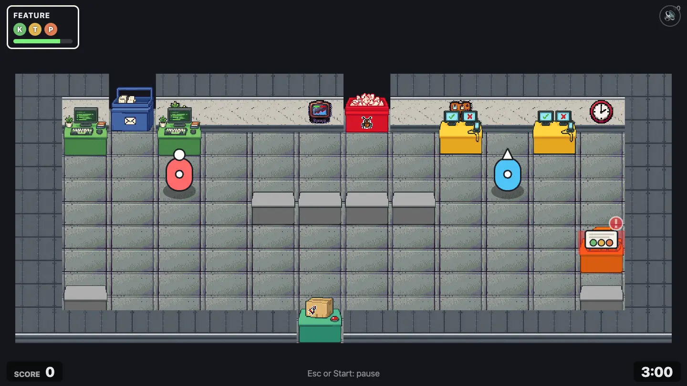 | 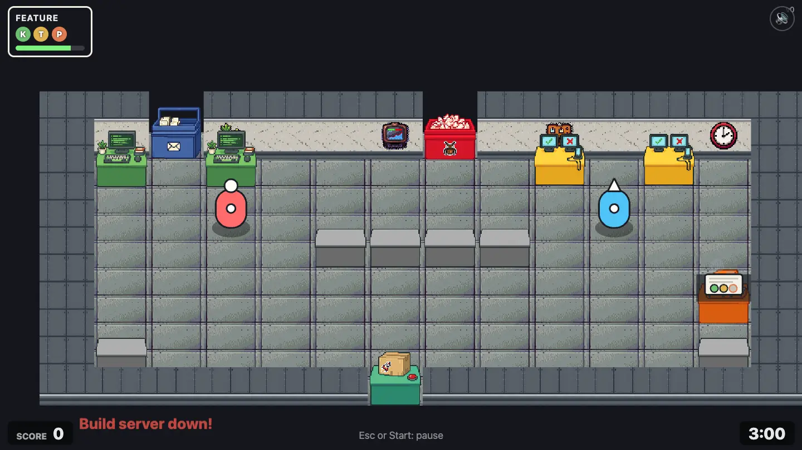 |

## Throwing (from Open Plan Office)

Hold pick-up while carrying a ticket to throw it. It flies along your facing, over floor and furniture, and lands on the first counter or station that can take it. A counter that already holds a ticket can't, so the ticket sails over it. A teammate with empty hands who faces the incoming ticket catches it. With nothing to land on it drops on the floor after about 5 tiles (or in front of a wall), where anyone can pick it up again.

Across a counter wall that means: throw it onto the empty counter in the wall for someone on the other side to pick up, or, if that counter is full, straight over it to a teammate.

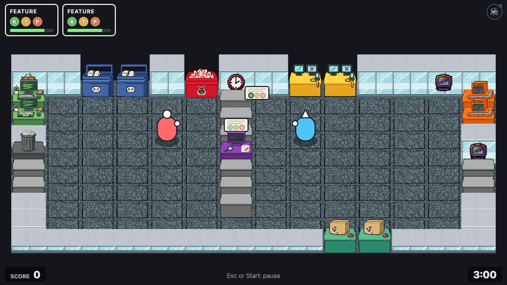

## Dash

Dash is a short burst of speed in the direction you face, about 2 tiles, with a short cooldown. Dash into a teammate and they get shoved out of the way ("Oof!", "Rude!", "Watch it!").

## The wandering manager (from chapter 3, Scale-Up)

A manager walks from spot to spot, stops for a chat and walks on. Players can't push a manager, and a walking manager shoves anyone in the way: "Got a minute?", "Quick sync?", "Per my last email...". Walk around. Hot Desking has two of them.

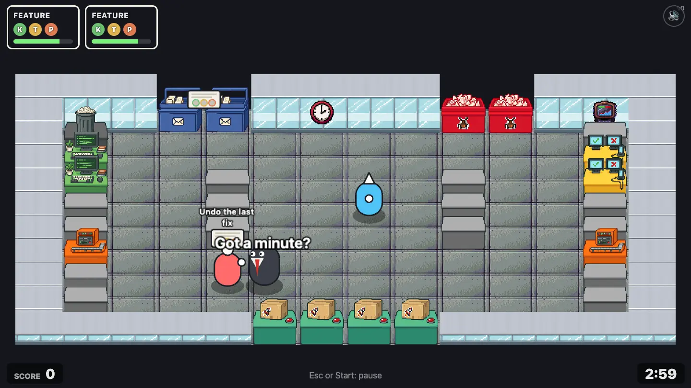

## Meetings (from chapter 4, Enterprise)

A calendar invite pops up for one of the players (each has at most one open): "Sync about the sync", "Mandatory fun", "Retro of the retro". The invited player has to stand in the meeting room for 4 seconds before the invite runs out (20 to 25 seconds). Time in the room counts even if you step out and back in, and you may keep carrying a ticket. A missed meeting costs 15 points. With more players, invites come more often.

| Invite                                                                  | In the meeting room                                            |
| ----------------------------------------------------------------------- | -------------------------------------------------------------- |
| 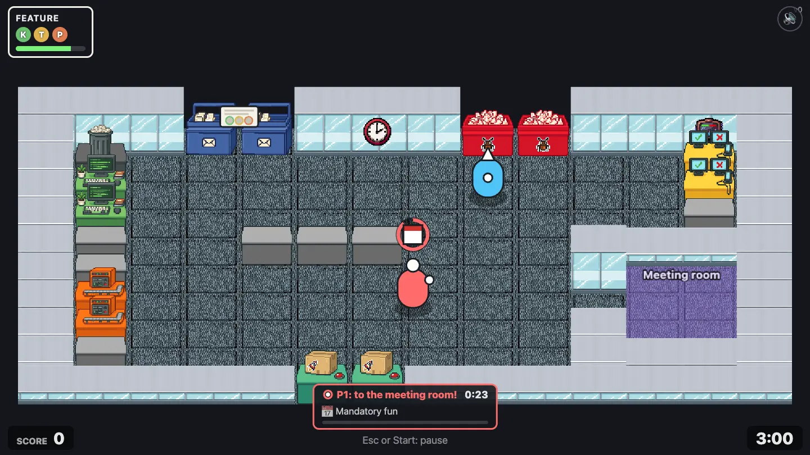 | 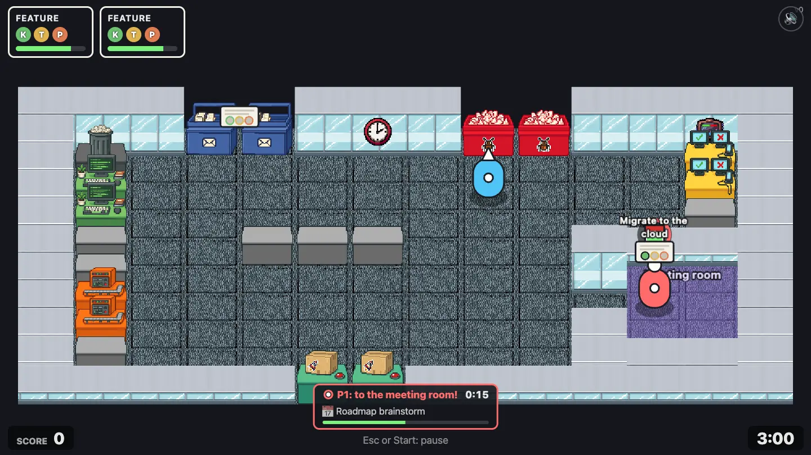 |

## Scoring at a glance

| Event                           | Points                        |
| ------------------------------- | ----------------------------- |
| Feature shipped                 | +20, plus up to +10 for speed |
| Hotfix shipped                  | +20, plus up to +10 for speed |
| Bug fix shipped                 | 0                             |
| Shipped after its order ran out | 0                             |
| Feature order runs out          | −10                           |
| Bug order runs out              | −20                           |
| Incident runs out               | −30                           |
| Meeting missed                  | −15                           |

Each level has three score targets for 1, 2 and 3 stars, scaled for the number of players. See [Levels](levels.md). Every number here lives in `src/sim/balance.ts`.
