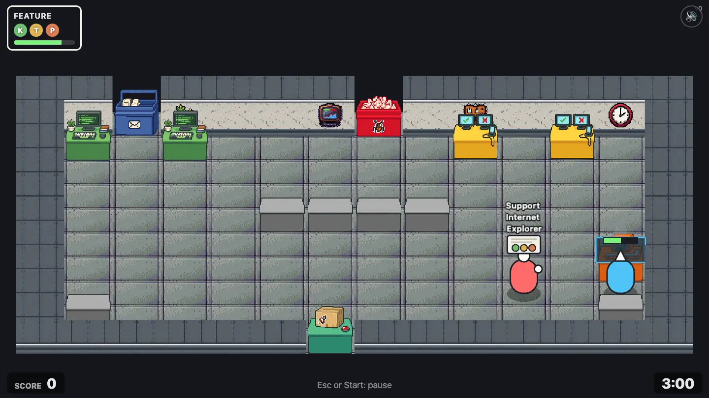

# Stations

Everything you interact with stands on a solid tile. You use it from the tile next to it, facing it: the block you face lights up in your color. Order cards and recipes name stations by letter: **K**eyboard, **R**eview, **T**est bench, **P**ipeline.

| Station      | Map char | Looks like                    | What it does                                                                                                  |
| ------------ | -------- | ----------------------------- | ------------------------------------------------------------------------------------------------------------- |
| Inbox        | `I`      | Blue tray with envelopes      | New feature tickets wait here. Pick-up takes the oldest one. A "x3" over it says how many are waiting.        |
| Bug queue    | `B`      | Red crate full of bugs        | Bug tickets and incident hotfixes wait here. Hotfixes always come out first.                                  |
| Keyboard     | `K`      | Green desk with a computer    | The **code** step. Put the ticket down and hold work. About 2.5 s of work.                                    |
| Review       | `R`      | Purple desk with a magnifier  | The **review** step. Needs **two players** holding work at the same time. About 3 s.                          |
| Test bench   | `T`      | Yellow desk with ✓/✗ screens  | The **test** step. Hold work, about 2.5 s. Tests are optional, but skipping them makes bugs much more likely. |
| Pipeline     | `P`      | Orange build machine          | The **pipeline** step. Builds on its own in 4 s, nobody needed. Collect the build in time or it breaks.       |
| Ship hatch   | `S`      | Green crate with a parcel     | Put a finished ticket here to ship it and complete its order.                                                 |
| Bin          | `X`      | Grey trash can                | Throws the carried ticket away for good. Its order stays open.                                                |
| Counter      | `C`      | Plain grey block              | Somewhere to put a ticket down and pick it up later. Counter walls split some offices in two.                 |
| Meeting room | `m`      | Purple carpet, "Meeting room" | Floor, not a station. Players with a calendar invite stand here. See [meetings](mechanics.md#meetings).       |

Other map chars: `#` wall, `.` floor, `1` to `4` player spawns, `M` where a manager starts.

## Working a station

A ticket only moves at the station for its next step: a fresh feature at a test bench does nothing. A progress bar over the ticket shows the current step.

| Coding at a keyboard                                     | Testing at a test bench                                     |
| -------------------------------------------------------- | ----------------------------------------------------------- |
|  |  |

Tests are the one step you may skip: carry a coded ticket straight to the pipeline. Once a ticket has moved past its test step, that test stays skipped.

## Review

Some feature orders show a purple **R**: they need a code review after coding. Two players stand at the review station and both hold work. One player alone gets nowhere.

## Pipeline

Drop a ticket on a pipeline and walk away: it builds by itself in 4 seconds. The finished build must be picked up within 10 seconds. In the last 4 of those it flashes a warning. Leave it longer and the build server goes down.

| Building                                                          | Warning: pick it up!                                        |
| ----------------------------------------------------------------- | ----------------------------------------------------------- |
|  |  |

A broken pipeline builds nothing and takes no tickets. Take the ticket out, then hold work at the empty pipeline for 3 seconds to repair it. Then build again.

| Broken: "Build server down!"                              | Repairing                                                        |
| --------------------------------------------------------- | ---------------------------------------------------------------- |
|  |  |

## Ship

Put a ticket with every required step done on a ship hatch. It completes the matching order with the least time left, and points pop up. A ticket whose order already ran out still ships, for nothing.

